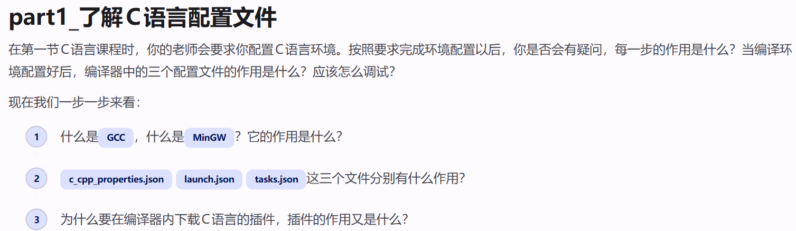
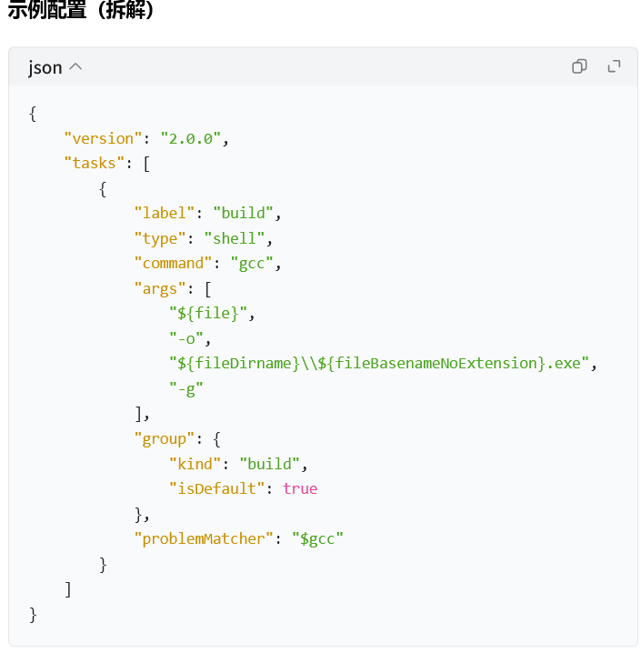
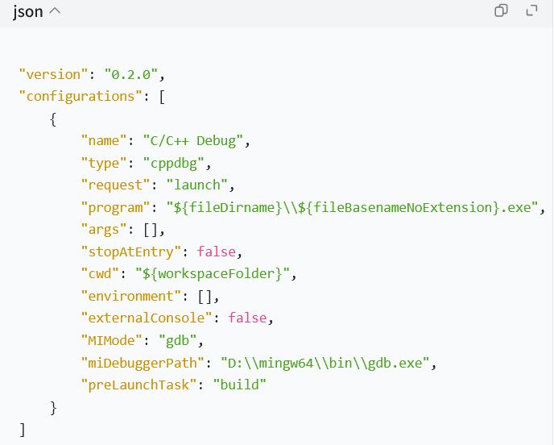
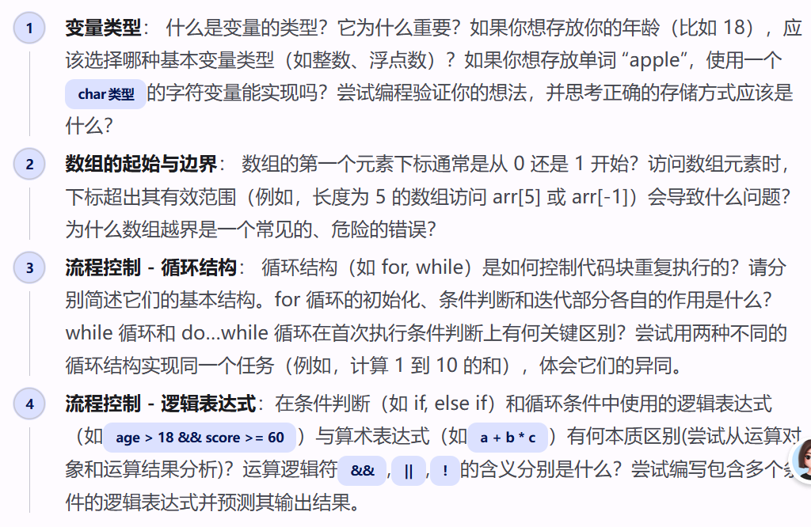

# GILMMER-CS--EASY---1-
微光工作室招新题cs笔记

part2代码写在hello.c,part1截图在anwser.md(image3和4)

## part1

ps:结合网站菜鸟教程和与ai的对话了解相关知识

1.
（1）**GCC（GNU Compiler Collection）**：[^GNU]编译器套件，是一套开源的编译器。可以编译 C、C++ 等语言源代码，把`.c`源码翻译成可执行程序。

[^GNU]:自由软件项目，打造类unix的操作系统

（2）**MinGW（Minimalist GNU for Windows）**：Windows 平台下的 GCC 移植版本。原生 GCC 是 Linux 工具，MinGW 把 GCC 移植到 Windows，让 Windows 系统可以使用 gcc/g++ 命令编译 C/C++ 代码，生成 Windows 下的 exe 程序。

2.
（1） **c_cpp_properties.json**：C/C++ 的**智能提示配置文件**
告诉 VSCode：[^头文件去哪里找]、[^编译器路径]、[^C语言标准版本]。作用是代码高亮、变量 / 函数提示、红色波浪线报错检查，**不负责[^编译]和[^调试]**。

[^头文件去哪里找]:`includePath`：头文件搜索目录
[^编译器路径]:`compilerPath`
[^C语言标准版本]: `cStandard`：C语言标准版本
[^编译]:输入.i,转换为.s汇编语言文件，c语言语法和类型检查并报错
[^调试]:让程序一步步走，找bug

(2)**tasks.json**：**编译任务配置文件**
定义编译命令，也就是调用`gcc`把`.c`源文件编译成`.exe`可执行文件。相当于一键执行`gcc test.c -o test.exe`。调试前需要先执行这个任务生成程序。

ps:`tasks.json`里写的`gcc test.c -o test.exe`这条命令，一次性走完：预处理 → 编译 → 汇编 → 链接，4个阶段全部做完，直接产出exe。

(3)**launch.json**：**调试启动配置文件**
负责启动调试器，运行编译好的 exe 程序，支持断点调试。可以配置使用内置终端还是外置控制台，是写代码时修改最多的配置文件。

ps:重点字段拆解：

1. `"program"`：**要调试的程序路径**，指定我们刚才 tasks.json 编译出来的 exe。
2. `"preLaunchTask": "build"`：**启动调试前自动运行 tasks.json 里面 build 编译任务**。保证每次调试，都是用最新修改后的代码生成 exe，避免代码改了但是没重新编译，调试旧程序。
3. `"miDebuggerPath"`：指定 gdb 调试器路径，gdb 才是真正用来调试程序的工具。
4. `"externalConsole": false`
   - `false`：使用 VSCode**内置终端**运行程序
   - `true`：弹出独立外置黑窗口控制台运行程序（就是你题目提到的经常修改的配置项）
5. `"stopAtEntry"`: 是否在main函数enter处自动暂停~·

**JSON**

JSON 是存储和交换文本信息的语法，类似 XML
1. JSON 只有两种顶层结构：
   - **对象 `{}`**：键值对集合
   - **数组 `[]`**：有序列表
2. **键（key）必须是双引号 `"` 包裹的字符串，不能用单引号、不能不加引号**
3. 值（value）只能是下面 6 种类型：
   - 字符串：`"hello"`（双引号）
   - 数字：`123`、`3.14`、`-5`（不能有八进制 / 十六进制）
   - 布尔：`true` / `false`（小写，不带引号）
   - 空值：`null`（小写，不带引号）
   - 对象：`{ ... }`
   - 数组：`[ ... ]`

> 不支持：函数、undefined、注释（标准 JSON 不能写 // 注释）

4. 键值对之间用逗号 `,` 分隔，**最后一项不能加逗号**（很多解析器会报错）
5. 大括号、中括号可以嵌套

## part2

1. 
（1）  **什么是变量类型**：变量类型规定了这个变量在内存中占用空间大小、数据解读方式、允许执行的运算。编译器依靠类型知道如何处理这块内存。

（2） **为什么重要**：

①  决定内存分配大小；

②  区分存储数据种类（整数 / 小数 / 字符）；

③  决定运算规则，整数除法、浮点数除法行为不同。

|占位符|	含义	|对应 C 类型|
|------|------|-----------|
|%d|	十进制有符号整数|	int|
|%u	|十进制无符号整数	|unsigned int|
|%f	|小数浮点数（默认保留 6 位小数）|	float / double|
|%c|	单个字符|	char|
|%s|	字符串	|char 数组 / 字符串|
|%x	|十六进制小写|	int|
|%o|	八进制|	int|

2. 数组的起始与边界

C 语言数组下标**从 0 开始**。长度为 5 的数组有效下标：0,1,2,3,4。没有内置边界检查。越界会读写不属于数组的内存，篡改其他变量、破坏栈内存。

3. 循环

`for(初始化;条件判断;迭代){
    循环体;
}`

`while(条件判断){
    循环体;
}`

4. 
- 算术表达式 `a+b*c`运算结果：**数字**
- 逻辑表达式 `age>18 && score>=60`
运算对象：**关系条件（真 / 假）**；运算结果只有两种：**真（非 0，常用 1）、假（0）**，用来做条件判断。
-  逻辑运算符含义

`&&` 逻辑与：两边全部为真，整体结果才为真；任意一边为假，整体为假。**短路：左边假，右边不执行**

`||` 逻辑或：任意一边为真，整体就为真；两边全部为假才是假。**短路：左边真，右边不执行**

`!` 逻辑非：取反，真变假，假变真。
